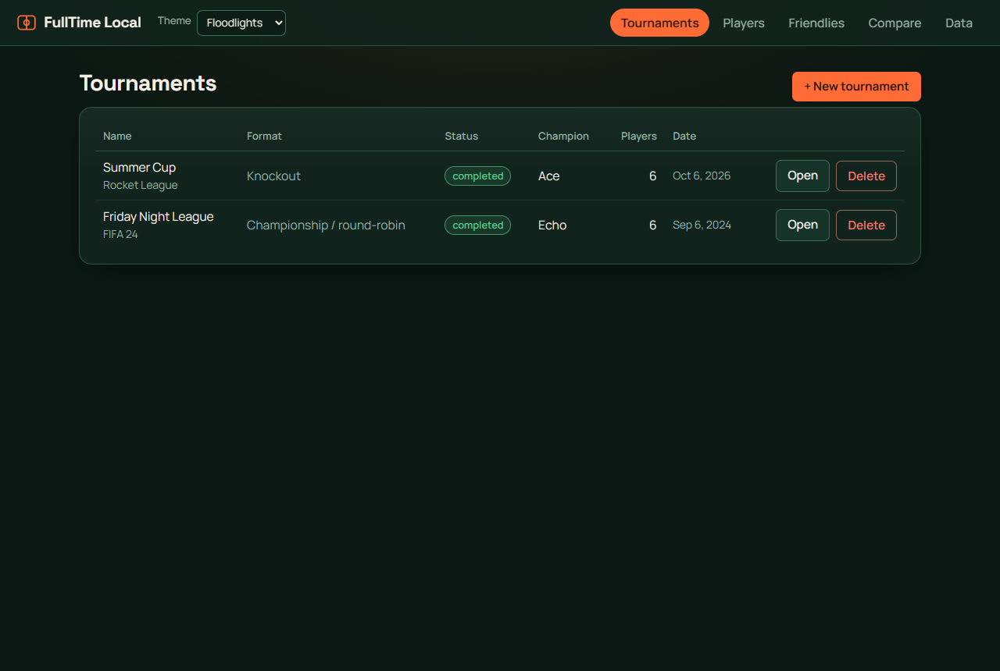
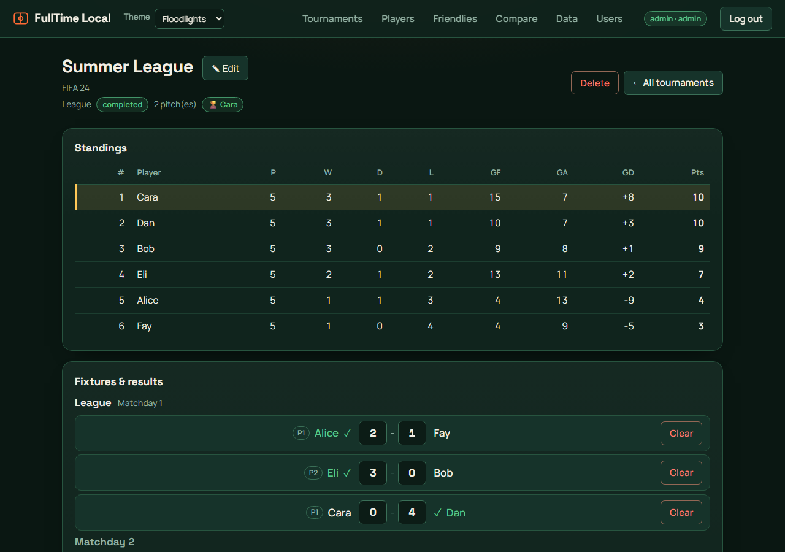
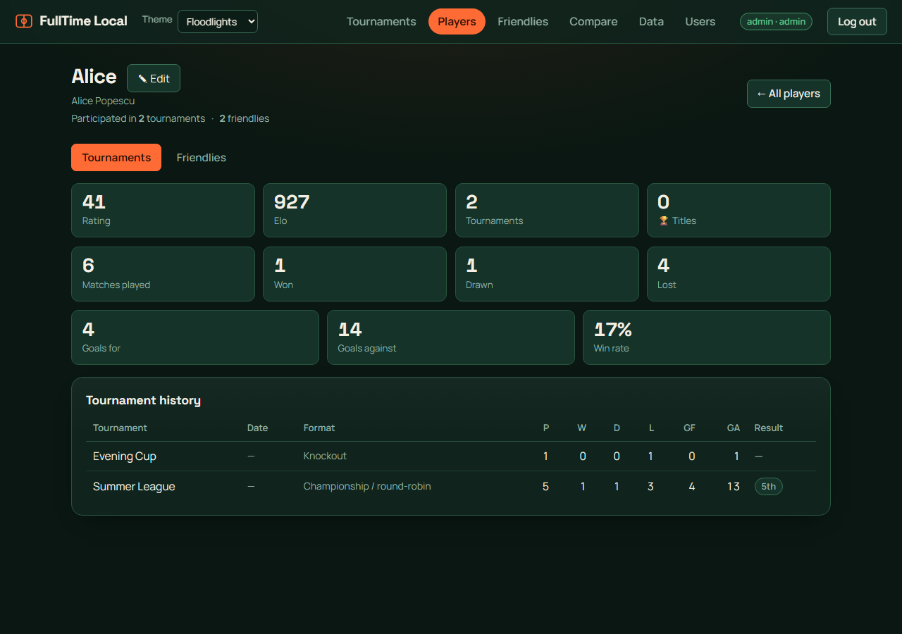
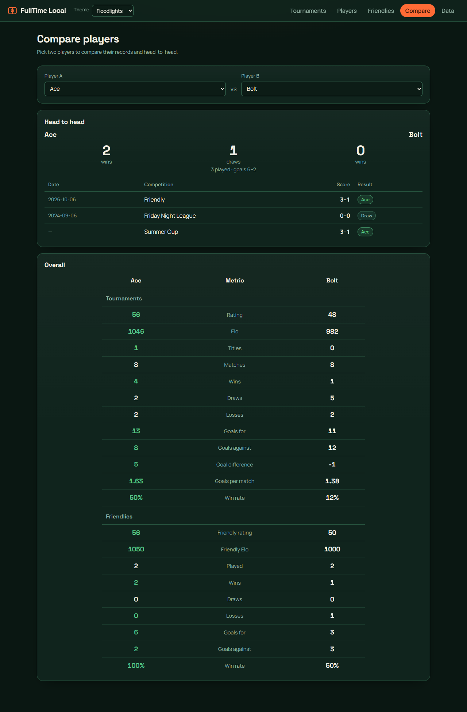
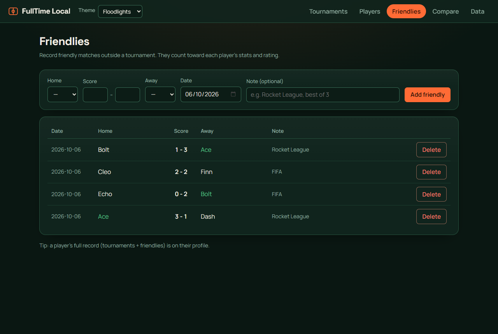
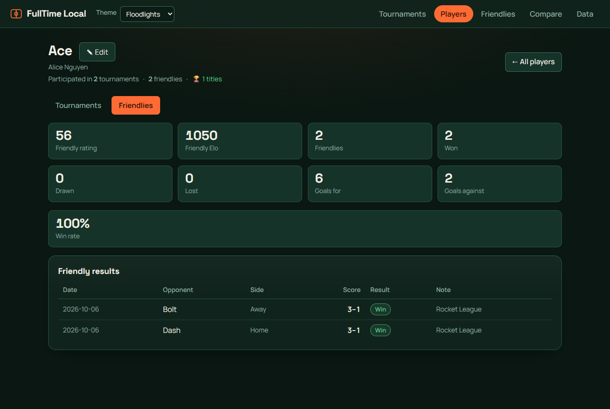

# FullTime Local

A small self-hosted app for running tournaments with friends — brackets, tables,
scores, stats and ratings. Everything stays on your machine.

Backend: FastAPI + SQLite. Frontend: React + Vite. Shipped as one Docker image.

---

## Features

- **5 tournament formats** — round-robin (single or home & away), knockout,
  group + finals, Swiss, and Champions League.
- **Auto-scheduling** across a set number of pitches/TVs, giving players fair rest.
- **Results & standings** — enter scores, tables update, knockouts advance, with a
  bracket view and an automatic champion.
- **Friendlies** — record casual one-off matches alongside tournaments.
- **Player profiles** — nickname + real name, plus separate tournament and
  friendly tabs.
- **Compare** any two players (head-to-head and side-by-side).
- **Automatic ratings** — an Elo for tournaments and one for friendlies.
- **Notes & themes** — tag a tournament with the game you played; 4 colour themes.
- **Optional password** — set `FTL_PASSWORD` to require a login.
- **Import** a legacy SQLite database.

---

## Screenshots

_Screenshots use mock data._

| | |
|---|---|
|  |  |
| Tournaments list | A league: standings + fixtures |
|  |  |
| Player profile (tournaments / friendlies tabs) | Compare two players |
|  |  |
| Recording friendlies | A player's friendly record |

---

## Quick start (Docker)

The image is public on GHCR — no login needed. Use this `docker-compose.yml`:

```yaml
services:
  app:
    image: ghcr.io/catadoxy/fulltime-local:latest
    ports:
      - "8756:8756"
    volumes:
      - ./data:/data
    restart: unless-stopped
```

```bash
docker compose up -d        # then open http://localhost:8756
```

The SQLite database lives in `./data/fulltime.db` on the host.

### Build from source instead

```bash
git clone https://github.com/catadoxy/fulltime-local.git
cd fulltime-local
docker compose -f docker-compose.build.yml up --build
```

---

## Run for development

**Backend**
```bash
cd backend
python -m venv .venv && source .venv/bin/activate   # Windows: .venv\Scripts\activate
pip install -r requirements.txt
uvicorn app.main:app --reload --port 8756
```

**Frontend**
```bash
cd frontend
npm install
npm run dev        # http://localhost:5173 (proxies /api to :8756)
```

---

## Ratings

Ratings are calculated automatically — nothing to set by hand. Each player has
**two Elo ratings**, both starting at 1000:

- **Tournament Elo** — from tournament matches only (Players list + Tournaments tab).
- **Friendly Elo** — from friendlies only (Friendlies tab).

Per match: `expected = 1 / (1 + 10^((opponent − you) / 400))`, then
`you += K × margin × (actual − expected)`, where a win is 1, a draw 0.5, a loss 0,
`K` is larger for new players, and `margin` gives a small bonus for a bigger win.
Penalty shoot-outs count as draws.

The 0–100 figure shown is `round(50 + (elo − 1000) / 8)` (1000 → 50, 1200 → 75).

---

## Importing existing data

Open **Data** and upload an **unencrypted** SQLite `.sqlite` database (the source
app's schema). Historical tournaments are imported as completed. Encrypted
exports are not supported — decrypt them first if needed.

Re-importing the same file is safe (tournaments already imported are skipped).
Tick **Replace all existing data** to wipe everything first and start clean.

---

## Configuration

All optional, via environment variables:

| Variable           | Default                            | Purpose                          |
| ------------------ | ---------------------------------- | -------------------------------- |
| `FTL_DATA_DIR`     | `backend/data`                     | folder holding the SQLite DB     |
| `FTL_DATABASE_URL` | `sqlite:///<DATA_DIR>/fulltime.db` | full database URL override       |
| `FTL_FRONTEND_DIR` | `frontend/dist`                    | where the built SPA is served    |
| `FTL_PASSWORD`     | *(unset)*                          | require this password to log in  |
| `FTL_SECRET`       | auto (file in data dir)            | session-cookie signing key       |

---

## Releases

Every push to `main` publishes `ghcr.io/catadoxy/fulltime-local:latest`. A version
tag publishes semver images (e.g. `:0.3.0`) **and** creates a GitHub Release:

```bash
git tag v0.3.0 && git push origin v0.3.0
```

Pin a version in production by using e.g. `ghcr.io/catadoxy/fulltime-local:0.3.0`.

---

## Development notes

- Tests: `cd backend && python -m pytest -q`
- Layout: `backend/app` (FastAPI — routers, models, `engine/` algorithms,
  `services/`) and `frontend/src` (React pages + typed API client).
- `Dockerfile` is a multi-stage build (Node build → Python runtime).
